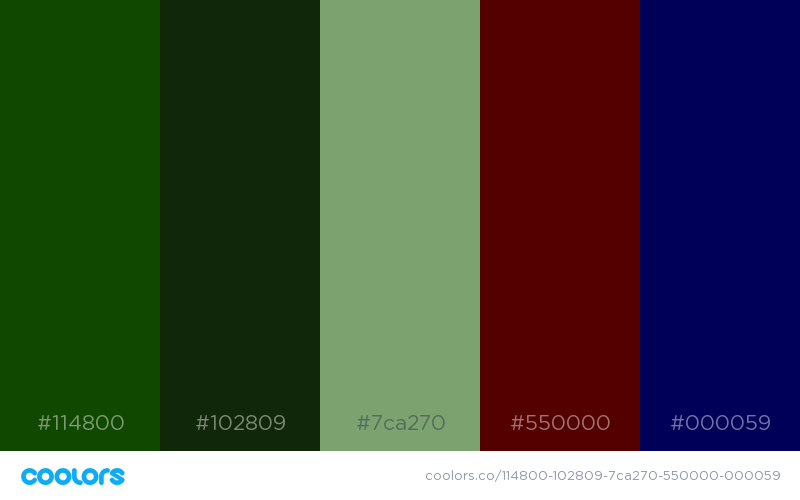

# Sam's `1st` project for General Assembly `w02d04`
====

<sam.younger@gmail.com> | <http://sam.younger.co.uk> | <https://github.com/samyounger>

##Initial planning: Idea foundations
====

- A game based on **Duck Hunt**, called **PolitiCat**
	* it is like **AngryBirds**, a shot is fired infront of the moving object to time a collision
	* the player is aiming to hit the **politician**
	* they will fire **cats** at the politician

##Features
- The game is for **one player**
- A politician selected at random is fired across a Westminster landscape
- The player has to throw a cat at the politician to hit them
- The politician will appear at a random speed, from different locations
	* fired out of the London Eye > furthest away so smallest
	* pop out of big-ben's clock > medium distance, medium size
	* walk across the pavement > closest, so biggest
- A **score counter** to see how many points the player scores
- Each level has ten politicians to throw cats at
- The player has 3 cat lives.
	*  Each missed politician they lose a life. If they miss 3x then the GAME OVER. 
	*  If they hit 10 politicians in a row, they gain an additional life
- Each time a player completes a game sequence, they move onto the next level
	* it levels up by **increasing the speed** and **number** of politicians which appear
- The game has no more than **ten levels**, so **100  politicians** in total

***

###Styling
- The font selection is: Kaushan Script
- The colour selections should be green to match the commons green seats

##Would like to have
Currently I do not have the technical capability to add this functionality, but this is the wish-list:

1. Ability for users to sign in and have a user profile to save their scores
2. The users with their profiles would be able to challenge other players, and email challenges to players not registered
3. This two-man game they would be able to each choose their own politician. Each round the game switches to the other player. The player can choose what item to throw at the politician; rose, rock, cat, elephant etc.
	* Connect the game to the twitter API
	* the twitter API searches for mentions of both politicians over the last month. If they are not mentioned and the player threw say roses, they would be marked up, if they threw rocks at a player mentioned regularly they would be marked up, and vice-versa for marking-down of the scores

##Pseudo `code`
###Introduction : `page1`
- Both players enter their names into a box on the landing page. 
- This page should be responsively designed, with a message saying: `this game is optimised for desktop play`
- Have a readme which explains that `any photos that are copyrighted will be removed immmediately but the page is for educational purposes.`
- Explanations for the game rules
- Contact details for the developer
- The player enters their last name, and select from a dropdown list the politician they want to play as.
	* the players last name, and the politicians first name are combined e.g. myName: Younger, politician: Boris => becomes Boris Younger.
		- consider halving each name, and combining to one e.g. using the example names above, Bornger ? 
- They are granted access to the game

***

###Game : `page2`
- There is a button on the page to start the game
	* also visible is both players names entered in the previous page, and a score counter
- Once clicked, politicians will start flying across the screen left to right and vice-versa
	* the direction will be decided by random
	* politician movement:
		- London-Eye && Big-Ben : steady arc
		- Pavement : straight line
- The cat destination is where the player clicks on the screen
- The cat speed will move in a linear fashion, on an arc trajectory
- When the cat reaches its target and they collide, the player gains a score
- As the game advances, the speed the politicians appear at increases